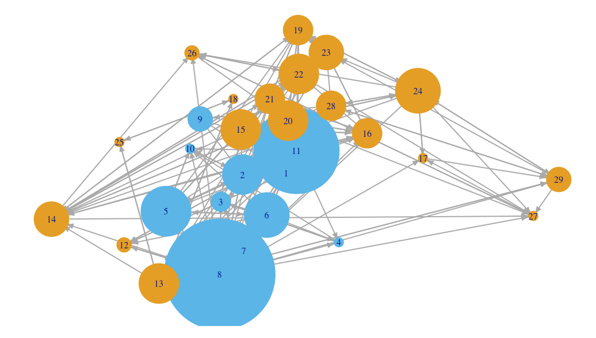
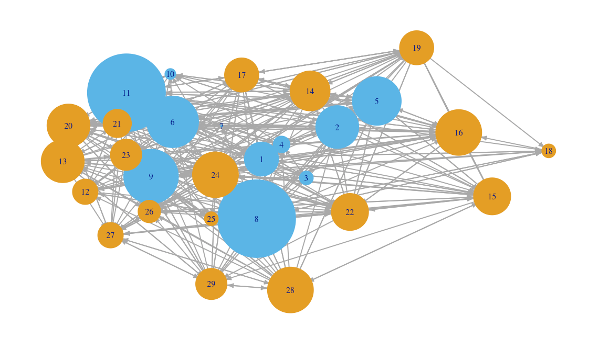
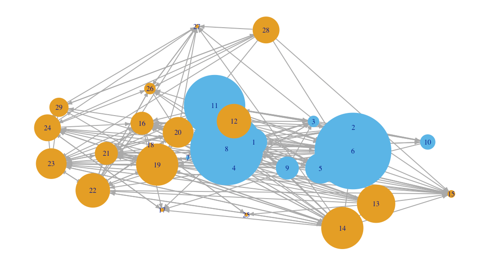

# Social Network Analysis

"Social network anlaysis has found utility is institutional, classroom and analyses of networked data in socially-based educational games. However, the utility of the method largely rests on being able to ascribe meaning to the **structure of the network**. Without meaningful interpretation of structure there is no added value to a networked model, you will find more suvccess simply regressing your outcome against student characteristics.  Understanding measures of centrality and network structure in SNA are therefore an important, though difficult, aspect of the method. As with all SNA work, the vocabulary can be daunting though the ideas are relatively intuitive."

## Project Description

In this project, I will be working towards building several social network diagrams (graphs/sociograms) of a school classroom and then analyzing both centrality measures and clusters within the network. The social network diagrams are built on the following questions of:
1. Who are your best friends?
2. Who do you get along with?
3. Who would you like to work with?

We find that everybody generally gets along with each other. The change between degree centrality between the network of best friends and those they get along with indicates that perhaps those who are good friends with each other may not nescessarily be the ones we'd like to work with - that, or person 6 is known to be intelligent or good to work with. The small amount of articulation points indicate the structure is stable and that the network is relatively interconnected. However, the amount of null connections in the triad_census show room for improvement in terms of interconnectedness. I would recommend to teachers to create more activities with randomized groups - this would increase interconnectedness between people. I'd like to know the grades of the people as well, and whether those people with similar grades selected each other to work with, to be best friends with, or to be someone they get along with. Yes, it's quite accurate. We were all quite close, there were a couple of people who didn't really interact with anybody. I'd say our null triad_census was far less however. The metric of the triad census indicates a large amount of null connections betwen three people.

Best Friends Diagram

Get Along With Diagram

Work With Diagram

## References

[Bakharia, A., & Dawson, S. (2011). SNAPP: A Bird’S-eye View of Temporal Participant Interaction. In Proceedings of the 1st International Conference on Learning Analytics and Knowledge (pp. 168–173). Banff, Alberta, Canada:ACM.](https://doi.org/10.1145/2090116.2090144)

[Hanneman, R. & Riddle, M. (2005). Introduction to Social Network Methods. Riverside, CA:  University of California, Riverside](http://faculty.ucr.edu/~hanneman/)  
  * [Chapter 10: Centrality & Power](http://faculty.ucr.edu/~hanneman/nettext/C10_Centrality.html)  
  * [Chapter 11: Cliques & Subgroups](http://faculty.ucr.edu/~hanneman/nettext/C11_Cliques.html) 
  
[iGraph. (2016). Get Started with R iGraph](http://igraph.org/r/#docs)

## Videos

[Williams, N. (2014). Basics of Social Network Analysis.](https://www.youtube.com/watch?v=PT99WF1VEws)

[Complexity Labs. (2015). Social Network Analysis Overview.](https://www.youtube.com/watch?v=fgr_g1q2ikA)

[Complexity Labs. (2015). Network Centrality.](https://www.youtube.com/watch?v=NgUj8DEH5Tc)

[Complexity Labs. (2015). Network Clustering & Connectedness.](https://www.youtube.com/watch?v=2Oa7mef77nM)

[Social Network Analysis with R - Examples](https://www.youtube.com/watch?v=0xsM0MbRPGE)

